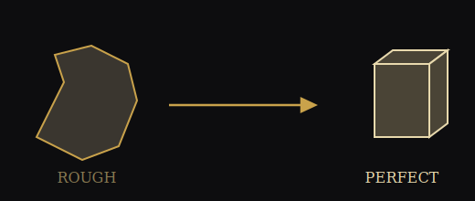

<!--
  Visita Interiora Terrae, Rectificando Invenies Occultum Lapidem.
  Visit the interior of the earth; by rectifying, thou shalt find the hidden stone.
  You are reading this because you looked past the rendered page. Good. That is the point.
-->

<p align="center">
  
</p>

<p align="center"><em>Ordo ab Chao.</em></p>

# Ashlar

Ashlar hews the rough stone of raw agent context — sprawling tool output, repeated file reads, verbose logs — into a perfect ashlar: dense, load-bearing, fit for the builder's use.

Every mason starts with a stone as it comes from the quarry: irregular, heavy, unfit for the wall. Before it can take its place in the temple, the Entered Apprentice is given three tools to work it — the 24-inch gauge, to measure; the common gavel, to knock off its superfluous corners; the chisel, to smooth what remains.

An AI agent's context is quarried the same way. Every tool call — a file read, a log dump, a search result — comes back mostly waste, its useful mass buried in noise. Ashlar puts the apprentice's three tools to that block before it ever reaches the model.

<p align="center">
  
</p>

## The Working Tools

**24-inch Gauge** — measures. Every block of context is counted before it is touched: tokens in, tokens out, waste identified.

**Common Gavel** — knocks off the gross excess. Repeated file reads collapse to diffs. Duplicate tool output collapses to one copy. The dead weight falls away before any fine work begins.

<!-- The 47th Problem of Euclid proves what the square only assumes. Measure twice; the ledger is the proof. -->

**Chisel** — smooths what the gavel leaves. Verbose logs, walls of stack trace, oversized search results — reduced to their load-bearing lines.

What enters the yard a rough ashlar leaves it a perfect one: smaller, denser, doing the same work in the wall.

## Keeping the Ledger

Every lodge keeps its minutes. `bin/ashlar` is the Secretary's book for this one — it records what each stone weighed before the gavel and after, so the labor of the workmen is never lost to memory.

```
$ ashlar record --before 14200 --after 3100 --label "grep dump, auth module"
Recorded: 14200 -> 3100 tokens (78% cut)

$ ashlar report
Stones dressed:   1
Rough weight:     14,200 tokens
Perfect weight:   3,100 tokens
Waste removed:    11,100 tokens (78%)
```

## Status

The lodge is at work. `record` and `report` stand today. The gavel and chisel — the actual compaction middleware that trims tool output before it reaches the model — are being cut on the yard.

## Installation

```
git clone <this-repo>
chmod +x ashlar/bin/ashlar
export PATH="$PATH:/path/to/ashlar/bin"
```

## License

MIT — see [LICENSE](LICENSE).

---

<p align="center"><em>So mote it be.</em></p>

<!--
  The Eye that watches the ledger is the same Eye that watches the work.
  What is measured cannot hide. What is hidden was only ever unexamined.
  G.
-->
